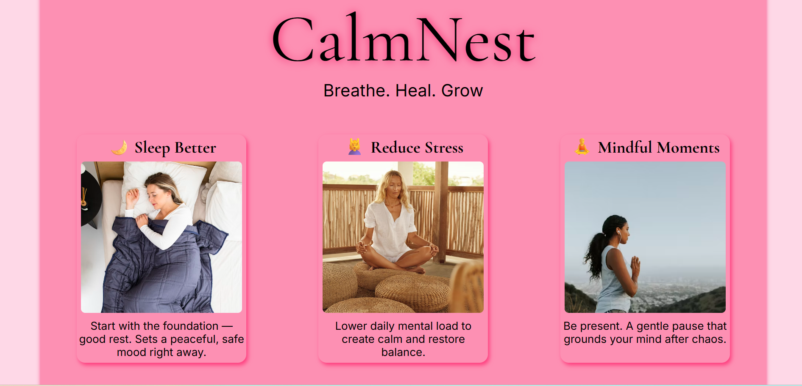
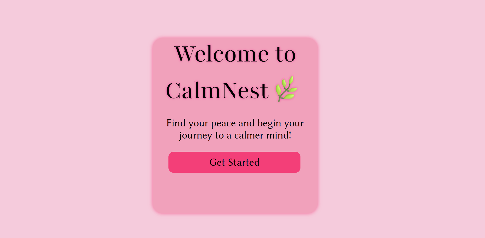
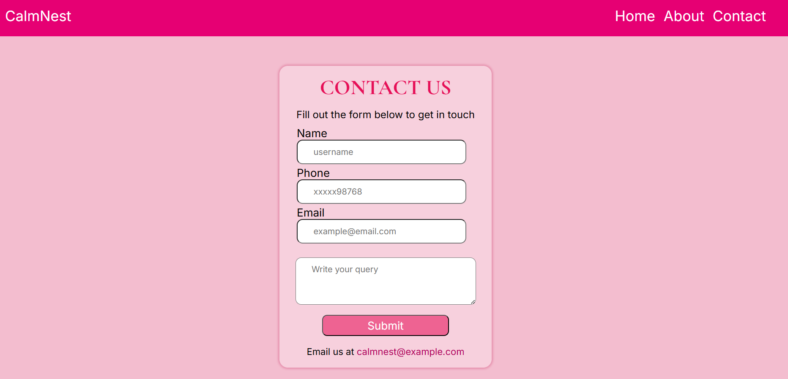
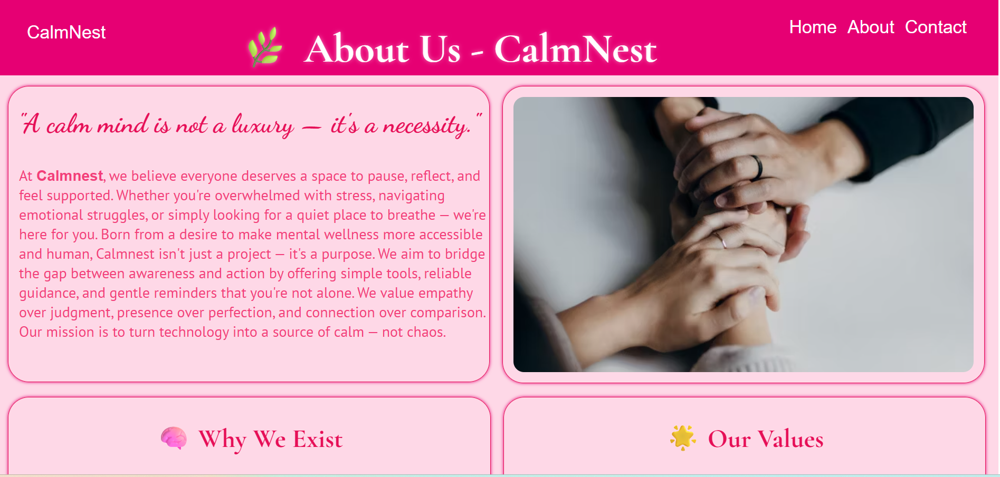
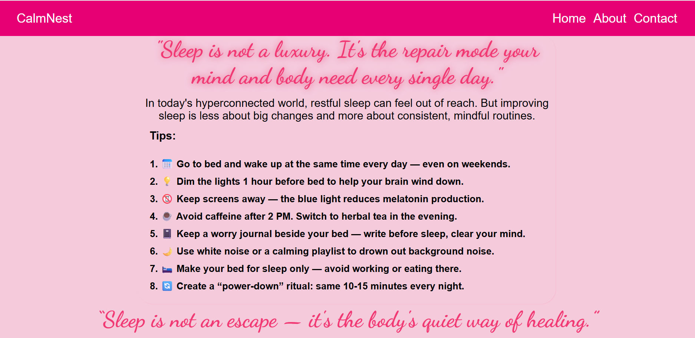

# 🌿 CalmNest – A Mental Wellness Website

**CalmNest** is a calming multi-page website focused on improving emotional wellbeing.  
It offers easy-to-access guidance for those struggling with sleep, overthinking, or stress.

This was built as part of my **first-ever hackathon experience**, where I set out to create something that feels warm, intentional, and helpful — even with simple tools and a beginner’s understanding.

---

## 🧘‍♀️ What It Offers

CalmNest contains pages focused on practical and emotional self-care, including:

- 🌙 **Sleep Hygiene Tips** – Gentle habits and routines for better rest
- 🧠 **Reducing Stress Tips** – Simple, everyday actions to manage mental pressure
- ✍️ **Pen-It-Down Journal** – Encouraging you to write down your thoughts to clear your mind
- 💭 **Moments of Calm** – Quick, mindful moments for emotional grounding
- 🗣️ **Talk to Yourself** – Positive affirmations and self-dialogue reminders
- 📬 **Contact Form** – For any feedback or communication
- 🏢 **About CalmNest** – A professional-style page introducing CalmNest as a wellness initiative

---
## 🚀 Features
- Mental wellness tips on sleep, stress, and self-reflection
- Responsive design for desktop and mobile
- Contact form with validation and reset
- Animated elements for engaging UI
- 
---
## 📌 Tech Stack

- HTML5  
- CSS3  
- Vanilla JavaScript  
- Responsive design using CSS media queries  
- Hosted on GitHub Pages  

---

## 🎯 Purpose

> CalmNest is designed to feel like a soft corner of the internet — a space to pause, reflect, and reset.  
> Whether you're overthinking at night or overwhelmed by the day, CalmNest offers guidance without pressure.

---

## 🚀 Live Demo

🔗 **[Click here to visit CalmNest](https://niyatipandey.github.io/CalmNest/)**  

---

## 📁 How to Run Locally

1. Clone the repository  
   ```bash
   git clone https://github.com/yourusername/CalmNest.git
## 🖼️ Screenshots

### 🏠 Home Page


### 🌄 Start / Welcome Page


### 📞 Contact Form


### 🏢 About CalmNest


### 🌙 Sleep Tips

